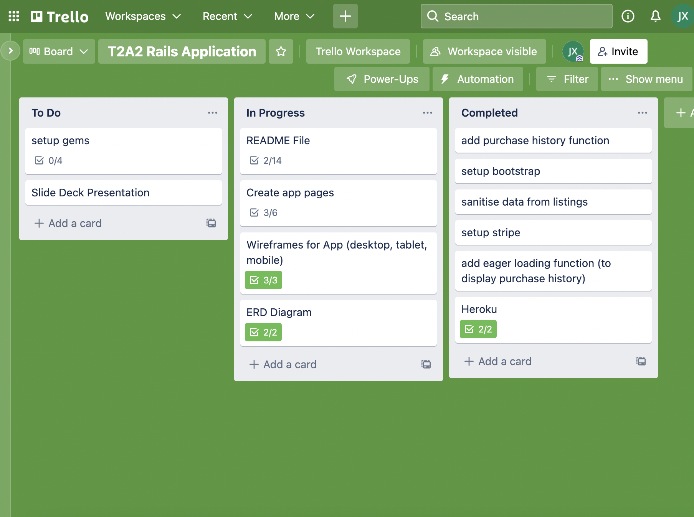
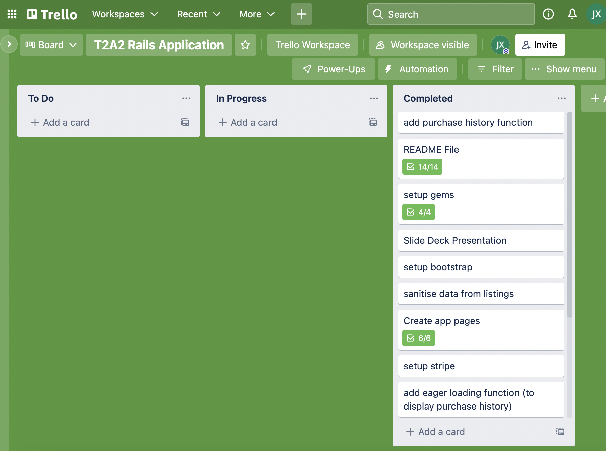

# Rails Project App - Collectibles Marketplace

**Heroku Deployment Link:** https://collectibles-app.herokuapp.com/

**Github Repo Link:** https://github.com/jamesxu1996/collectibles

**Identification of the problem you are trying to solve by building this particular marketplace app**

**Why is it a problem that needs solving?**

**Collectibles Marketplace Description**
- **Purpose**

- **Functionality / features**

- **Sitemap**

- **Screenshots**

- **Target audience**
The target audience for the Collectibles marketplace application are people who do not want to use a general marketplace such as Amazon or eBay and want to facilitate transactions over a more niche marketbase. Anything from rare cards, watches, cameras, antiques; buyers and sellers will be able to transact and discover items that they enjoy collecting rather than a mass-consumer marketplace where there things are sold in large quantities or where rarer objects are not normally posted. This also makes it easier on the buyer to find rare items to buy or the seller to find buyers for their niche items.

- **Tech stack (e.g. html, css, deployment platform, etc)**

**User stories for your app**

**Wireframes for your app**

**An ERD for your app**

**Explain the different high-level components (abstractions) in your app**

**Detail any third party services that your app will use**

**Describe your projects models in terms of the relationships (active record associations) they have with each other**

**Discuss the database relations to be implemented in your application**

**Provide your database schema design**

**Describe the way tasks are allocated and tracked in your project**
Tasks for the project were managed and allocated using Trello. The board was set up in 3 sections: To do, In Progress and Completed. As tasks were being completed, they would be placed in the in progess column and when completed would be moved to the completed column. Checklists were used in each card to tick off as the task was being done; this segments the tasks even further and breaks down a large undertaking (creating the collectibles app) into more manageable bite sized pieces. The link to the board is here: https://trello.com/invite/b/ziol20AC/4f1ebe21fde38e42f0cbb336bd684938/t2a2-rails-application

Pictures of the board in progress are shown below:

