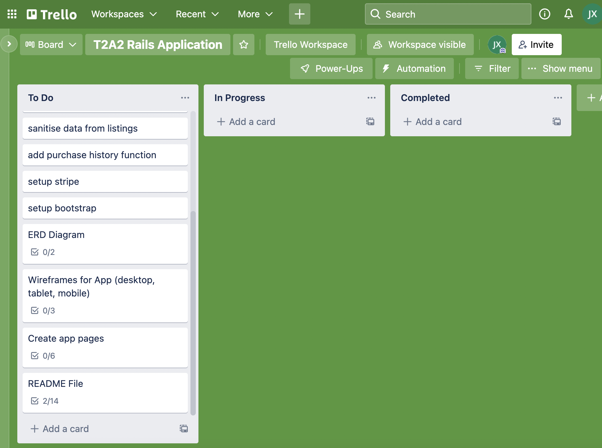

# Rails Project App - Collectibles Marketplace

**Heroku Deployment Link:** https://collectibles-app.herokuapp.com/

**Github Repo Link:** https://github.com/jamesxu1996/collectibles

**Identification of the problem you are trying to solve by building this particular marketplace app**
The problem being solved is the issue of marketplace apps appealing and providing services to niche markets. There are many marketplace stores online these days and it is difficult sometimes to find exactly what you want when it is a collectible rare item. Collectors are spread far and wide and bringing them together in a single spot makes it easier to find communities to buy/sell items which are not available in the general market to the public. There are antiques, watches, cards and other collectibles which are hard to come by and unless you're 'in the know', it can be a challenge to buy or sell. Collectible app attempts to bridge this gap by offering a marketplace where niche markets can come together and put their goods up for sale.

**Why is it a problem that needs solving?**
To allow rare items to be accessible to more people. Some people are scared away or put off by the fact that some hobbies have difficult items to procure (e.g trading card games; there are many rare cards which can be difficult to source or find or even watches that are rare and near impossible to get ahold of). Also, it may offer some people an extra stream of income if it becomes easier to sell their items which normally would be a grand undertaking where a seller would need to reach out and hope a buyer who is aware of their product contacts them directly. By having a niche marketplace available to a community, some buyers may even stumble accross the listing just by being on the collectibles app. Also, recycling is encouraged by exchanging goods through multiple hands. In general, it allows more people to share the joy of whatever they collect with more people.

**Collectibles Marketplace Description**
- **Purpose**
The purpose of the app is to allow buyers/sellers to buy or sell/exchange their rare items or collectible with one another. This allows people who may be thinking about diving into a hobby to be more open since the items can be purchased via the app.

- **Functionality / features**
The collectibles app allows users to register and sign in with a unique profile. Users can then buy or sell through listings and allows images to share what they're selling. Users can see what they've purchased through their purchases history. Listings can be viewed without logging in but need to log in to purchase.

- **Sitemap**

- **Screenshots**

- **Target audience**
The target audience for the Collectibles marketplace application are people who do not want to use a general marketplace such as Amazon or eBay and want to facilitate transactions over a more niche marketbase. Anything from rare cards, watches, cameras, antiques; buyers and sellers will be able to transact and discover items that they enjoy collecting rather than a mass-consumer marketplace where there things are sold in large quantities or where rarer objects are not normally posted. This also makes it easier on the buyer to find rare items to buy or the seller to find buyers for their niche items.

- **Tech stack (e.g. html, css, deployment platform, etc)**
HTML, CSS, Ruby, Ruby on Rails, Javascript, AWS S3, Heroku

**User stories for your app**
"As a user, I want to sign up and buy 

**Wireframes for your app**
 in your app**

**Detail any third party services that your app will use**

**Describe your projects models in terms of the relationships (active record associations) they have with each other**

**Discuss the database relations to be implemented in your application**

**Provide your database schema design**

**Describe the way tasks are allocated and tracked in your project**
Tasks for the project were managed and allocated using Trello. The board was set up in 3 sections: To do, In Progress and Completed. As tasks were being completed, they would be placed in the in progess column and when completed would be moved to the completed column. Checklists were used in each card to tick off as the task was being done; this segments the tasks even further and breaks down a large undertaking (creating the collectibles app) into more manageable bite sized pieces. The link to the board is here: https://trello.com/invite/b/ziol20AC/4f1ebe21fde38e42f0cbb336bd684938/t2a2-rails-application

Pictures of the board in progress are shown below:

